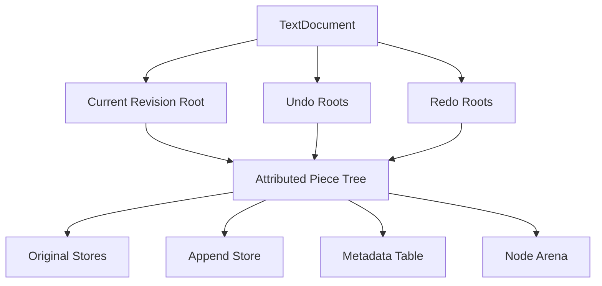
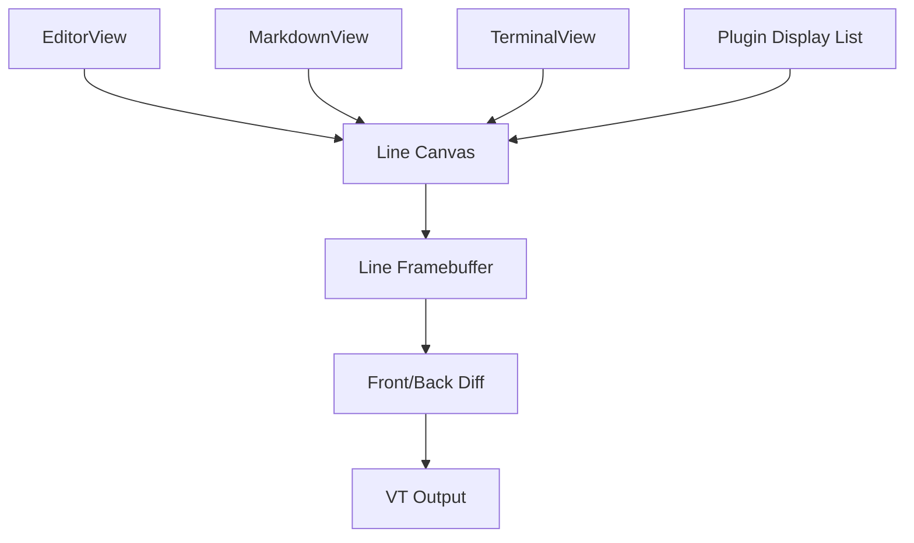
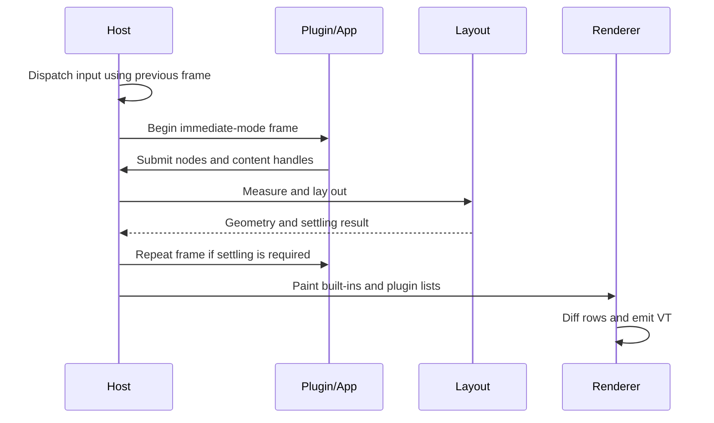

# Text Storage, Rendering, and Plugin Architecture Plan

## Status

This is a living design and implementation plan. It records the evidence gathered so far,
the alternatives considered, the current recommendation, and the measurements required
before committing the editor to that recommendation.

The proposed storage design is provisional. It is deliberately structured so that a
standalone prototype can disprove it before the existing `GapBuffer` is removed.

## Executive Summary

The editor has three related architectural needs:

1. Replace brittle, heap-backed, replay-based undo/redo with storage-level revisions.
2. Support intrinsic attributed text for terminal contents and generated rich text, while
   keeping derived attributes such as syntax highlighting outside source text.
3. Replace the first-generation TUI with a rendering and UI architecture that remains
   intentionally representable through a stable C ABI.

The current recommendation is to prototype one concrete, arena-allocated, fixed-fanout
B+ piece tree with packed attributed spans. The same tree mechanics would be used with
different retention policies:

- An editor retains roots as undo/redo revisions.
- A terminal normally retains only its current root and mutates transaction-owned nodes
  in place.
- A generated projection may build a transient attributed revision.

This is not yet a decision to replace `GapBuffer`. The tree must first demonstrate
acceptable editing speed, scan speed, memory growth, compaction behavior, implementation
size, and release binary size.

Rendering remains line-oriented. The existing framebuffer's model of UTF-8 rows plus
parallel style information is a better foundation than a dense cell grid for this
project. Text storage, editor state, layout, projection, terminal emulation, and final VT
diffing should become separate components.

TUI v2 should remain immediate mode and ABI-first. Built-in content can use concrete Rust
dispatch. Plugins use opaque handles and a versioned C function table with POD arguments.
In-process plugins should not pay for a serialized binary command protocol unless a future
out-of-process plugin model requires one.

## Goals

- Make undo and redo root selection, not inverse mutation replay.
- Store inserted and deleted text once rather than copying deleted text into heap history.
- Preserve the virtual-memory advantages currently used by `GapBuffer` and `Arena`.
- Keep sequential scanning and rendering efficient.
- Support intrinsic attributes and semantic markers in the stored sequence.
- Support editor text, terminal text, and generated rich text without immediately adding
  multiple independent sequence implementations.
- Keep Unicode, line, search, and highlighting algorithms usable across chunk boundaries.
- Keep the release binary small and avoid generic monomorphization where it does not buy
  meaningful safety or performance.
- Preserve immediate-mode UI construction and an ABI-first public surface.
- Allow incremental migration and direct comparison with the existing implementation.

## Non-Goals

- This plan does not require source API compatibility. The current internals may be
  reshaped freely.
- It does not introduce collaborative editing or CRDT semantics.
- It does not require arbitrary historical branches in the initial UI, although retained
  roots make them possible.
- It does not require concurrent mutation. The first implementation may remain
  single-threaded like the current editor.
- It does not require syntax highlighting or theme colors to become intrinsic document
  attributes.
- It does not require a generic widget trait or a generic text-storage trait hierarchy.
- It does not require an out-of-process or sandboxed plugin protocol.

## Constraints

### Performance

- Interactive edits must remain far below perceptible latency.
- Whole-document scans, search, syntax highlighting, save, and reflow must not be made
  pathologically slower by small pieces.
- Terminal bulk output and nearby cursor-positioned writes must both be efficient.
- The design must favor contiguous runs and stateful cursors rather than repeated root
  lookups.

### Memory

- Text bytes should live in virtually reserved, incrementally committed stores.
- Tree nodes and history metadata should be bump allocated.
- No per-node system-heap allocation or atomic reference count should be required.
- Dead persistent nodes and unreachable append-store bytes need explicit policies.

### Binary Size

- The tree should be one concrete implementation, not generic over span, metrics,
  allocator, or mutation policy unless measurement justifies it.
- New dependencies require strong justification.
- The release profile uses `opt-level = "s"`, one codegen unit, LTO, and symbol stripping.
- Binary size must be measured from clean release builds. LOC is not a reliable proxy.

### ABI

- Public plugin structures must be C-representable.
- Plugins must use integer or generational handles rather than Rust references.
- Cross-boundary memory ownership and lifetimes must be explicit.
- The Rust implementation should exercise the same C-shaped operations exposed to
  plugins, so ABI constraints remain real during development.

## Measured Baseline

### Current Source Footprint

These are physical line counts measured on 2026-08-23:

| Component | File | Lines | Nonblank |
| --- | --- | ---: | ---: |
| Text buffer | `crates/edit/src/buffer/mod.rs` | 3,156 | 2,701 |
| Gap buffer | `crates/edit/src/buffer/gap_buffer.rs` | 356 | 297 |
| Word navigation | `crates/edit/src/buffer/navigation.rs` | 290 | 240 |
| Document traits | `crates/edit/src/document.rs` | 102 | 88 |
| Framebuffer | `crates/edit/src/framebuffer.rs` | 989 | 854 |
| TUI | `crates/edit/src/tui.rs` | 4,112 | 3,611 |
| Highlight cache | `crates/edit/src/lsh/cache.rs` | 87 | 74 |
| Highlighter adapter | `crates/edit/src/lsh/highlighter.rs` | 147 | 119 |
| Unicode measurement | `crates/edit/src/unicode/measurement.rs` | 1,062 | 952 |
| Input | `crates/edit/src/input.rs` | 599 | 538 |
| Release arena | `crates/stdext/src/arena/release.rs` | 241 | 209 |
| Entire `crates/edit/src` | | 20,997 | |

The observed release executable was 454,144 bytes. That value is a reference point, not a
reproducible baseline until a clean build procedure and artifact configuration are fixed.

### Editing Trace

`assets/editing-traces/rustcode.json.zst` describes a real editing workload:

| Metric | Value |
| --- | ---: |
| Compressed fixture | 189,786 bytes |
| Decompressed JSON | 2,898,975 UTF-8 bytes |
| Transactions | 36,981 |
| Patches | 40,173 |
| Inserted bytes | 522,531 |
| Deleted bytes | 457,313 |
| Insert-only patches | 33,025 |
| Delete-only patches | 4,924 |
| Replacement patches | 2,224 |
| Maximum insertion | 69,106 bytes |
| Maximum deletion | 69,106 bytes |
| Maximum document size | 133,324 bytes |
| Final document size | 65,218 bytes |
| Final logical lines | 1,707 |

Edit locality is exceptionally high:

| Consecutive patch offset delta | Value |
| --- | ---: |
| Median | 1 byte |
| 90th percentile | 69 bytes |
| 99th percentile | 9,207 bytes |
| At most 64 bytes | 89.68% |
| At most 1 KiB | 97.20% |
| Maximum | 61,123 bytes |

This is strong evidence for retaining a stateful cursor or tree finger and for coalescing
nearby insertions. It is also why the current gap buffer performs so well.

### Current Benchmark

The requested command produced:

```text
cargo bench buffer/TextBuffer/rustcode

time: [8.2545 ms 8.2884 ms 8.3243 ms]
```

The underlying raw gap-buffer benchmark produced:

```text
buffer/GapBuffer/rustcode
time: [776.14 us 779.39 us 783.42 us]
```

Criterion reported regressions against its saved baseline. Those percentages are not
meaningful here because Windows foreground boosting favors the foreground process while
the benchmark shell runs in the background. Absolute intervals must also be collected
under matched scheduling conditions before comparing implementations.

The benchmark is not a direct container comparison. `TextBuffer` also performs logical
cursor navigation, grapheme deletion, newline handling, undo capture, statistics updates,
and cache invalidation. Parsing and decompressing the fixture are outside the timed loop.

The benchmark currently flattens recorded transactions into patches. A storage prototype
needs a second benchmark that preserves the fixture's transaction boundaries, because
revision allocation and undo grouping depend on those boundaries.

## Current Architecture and Problems

### GapBuffer

The current `GapBuffer` has useful properties worth preserving in spirit:

- Large buffers reserve 4 GiB of virtual address space on 64-bit systems.
- Memory is committed in 64 KiB chunks.
- The gap grows in 4 KiB chunks.
- Text exists as at most two large contiguous byte slices.
- Moving the gap is one overlapping memory copy.
- Insertions at the gap and deletions adjacent to it are cheap.
- Small buffers use a `Vec` specialization.

Its main architectural deficiency is not editing performance. It is that historical text
is not represented structurally, so undo must separately copy and replay changes.

### Undo and Redo

`HistoryEntry` stores deleted and added bytes in heap `Vec`s and also stores enough cursor,
selection, statistics, and generation state to reverse an edit. Undo swaps the added and
deleted vectors, replays the mutation, adjusts newline representation, swaps editor state,
and manipulates generations.

Consequences:

- Deleted text is copied into the system heap.
- Large deletes defeat much of the virtual-memory strategy.
- Correctness depends on reverse operations exactly mirroring every forward path.
- Grouping, CRLF handling, line statistics, selections, and generations are entangled.
- Current test coverage does not systematically exercise undo/redo invariants.

### TextBuffer Coupling

`TextBuffer` currently owns:

- Text storage.
- Undo and redo.
- Cursor and selection state.
- Encoding and newline policy.
- Search state.
- Logical and visual line statistics.
- Word-wrap width and tab layout.
- Syntax-highlighting cache and language selection.
- Margin, ruler, current-line highlighting, and rendering.
- A request flag used to tell the TUI to scroll the cursor into view.

This makes storage changes harder than necessary and prevents editor, terminal, and
projection views from sharing a rendering pipeline without sharing unrelated editor state.

### Chunk Contract

`ReadableDocument` currently returns slices and promises not to split grapheme clusters
across chunks. `MeasurementConfig` relies on that promise. A piece tree cannot naturally
guarantee it:

- An insertion may begin with a combining character that joins the preceding piece.
- ZWJ and other extended grapheme sequences may span pieces.
- UTF-8 input and raw replacements require well-defined malformed-input behavior.

The storage prototype must therefore include a stateful text cursor and update Unicode
measurement to continue decoding and grapheme segmentation across chunks. It is not safe
to assume that the existing measurement code can consume arbitrary piece slices unchanged.

### Rendering and TUI

The framebuffer already uses line strings plus parallel foreground, background, and
attribute arrays. This is a suitable final-frame representation for efficient terminal
diffing.

The TUI is immediate mode and uses two frame arenas. That direction remains appropriate,
especially because avoiding per-widget callbacks makes a C ABI straightforward. The
problem is the first-generation implementation and its coupling, not immediate mode itself.

## Architecture Principles

1. Share sequence mechanics, not every higher-level behavior.
2. Keep intrinsic content in storage and derived presentation in overlays.
3. Make history a property of retained roots, not replay code.
4. Keep hot traversal stateful and linear.
5. Prefer packed arrays and arena allocation over per-record heap objects.
6. Keep storage concrete to control code generation and binary size.
7. Keep the final frame line-oriented.
8. Make the ABI authoritative and intentionally plain.
9. Separate migrations so storage and TUI failures can be isolated.
10. Require measurements before introducing a second storage engine or a hot-leaf gap.

## Alternatives Considered

### Keep GapBuffer and Repair Heap Undo

Possible changes include arena-allocating undo byte copies, simplifying history grouping,
and adding comprehensive tests.

Advantages:

- Lowest implementation risk.
- Preserves current edit and scan performance.
- Reuses almost all navigation and rendering code.

Disadvantages:

- Undo remains replay-based and therefore structurally brittle.
- Deleted bytes still need to be copied somewhere.
- Immutable snapshots and time travel remain expensive.
- Terminal attributes still require a new representation.

This is a viable fallback if the tree prototype fails, but it does not solve the central
history problem.

### Multiple Specialized Storage Engines

Examples are retaining `GapBuffer` for files, adding a tagged gap/run buffer for terminals,
and using a separate projection store for Markdown.

Advantages:

- Each workload gets a directly optimized representation.
- The current editor can remain untouched while terminal support develops.

Disadvantages:

- Duplicate mutation, traversal, line seeking, Unicode-boundary, testing, fuzzing, and
  diagnostic logic.
- More code and more binary-size pressure.
- Performance improvements and bug fixes must be carried across implementations.

Do not begin with this architecture. Add a second engine only when real terminal or editor
traces demonstrate that one sequence implementation cannot meet requirements.

### Ropey or Another General Rope

Advantages:

- Mature tree implementation and logarithmic indexing.
- Lower initial implementation cost.

Disadvantages:

- Does not directly provide the desired arena ownership and persistent revision model.
- Does not naturally encode intrinsic terminal attributes and markers.
- Chunking may reduce whole-document search and scan throughput.
- Adds dependency and binary-size costs.
- The editor still needs custom grapheme, terminal-column, wrapping, and ABI behavior.

This remains useful as a correctness or benchmark reference, not the current target design.

### Persistent Red-Black Piece Tree

The implementation cited in the current source is approximately 2,686 production lines
plus 742 test lines. It demonstrates simple root-based undo, but immutable red-black
deletion and balancing are notably difficult.

The useful ideas are immutable roots, original/add stores, piece coalescing, attributed
metrics, and stateful walkers. The exact persistent red-black structure is not preferred.

### Fixed-Fanout B+ Piece Tree

This is the provisional recommendation. Fixed-fanout pages allow a transaction to copy the
root-to-leaf path and then use ordinary mutable B-tree operations on transaction-owned
pages. This avoids functional red-black deletion while retaining persistent roots.

### Tree With a Gap Inside the Hot Leaf

A leaf-local gap could make repeated nearby insertions cheaper, but it adds another state,
normalization rules before snapshotting, and more mutation paths. Defer it. First determine
whether transaction-owned packed leaves and adjacent span coalescing are already fast
enough.

## Proposed Storage Architecture

### Overview



### Text Stores

Use stable byte stores so spans never point into movable vectors:

- Original stores contain loaded file contents or immutable imported chunks.
- One append store receives inserted bytes.
- Both reserve virtual address space and commit incrementally.
- An append operation returns a stable `TextRef`.
- A span references `{ store_id, offset, byte_len }`.

The initial prototype may copy loaded content into an original virtual-memory store. File
mapping can be evaluated separately; it should not complicate the first tree implementation.

### Metadata

Intrinsic metadata is interned and referred to by a small `MetaId`:

- Terminal foreground and background.
- Terminal rendition attributes.
- Hyperlink identity.
- Hard-line or semantic markers where needed.
- Generated-content source identity if it is truly intrinsic to that projection.

Syntax highlighting, diagnostics, search matches, selections, current-line highlighting,
and theme-resolved colors remain overlays associated with a revision or view.

The first prototype should store a complete `MetaId` on each text span. Start/end state
tags remain a legitimate alternative, especially for compact forward and backward
traversal, but they create additional splice questions:

- Which side owns a zero-width transition at an insertion boundary?
- What state results when a deletion removes only one boundary?
- How is the previous value recovered during reverse traversal?
- How are nested and non-nested state systems normalized?

Complete interned state makes random access, splitting, deletion, and reverse traversal
unambiguous. A terminal trace can later compare its memory cost with boundary deltas.

### Span Shape

An illustrative, not final, representation is:

```rust
#[repr(C)]
#[derive(Clone, Copy)]
struct Span {
    text: TextRef,
    byte_len: u32,
    line_feeds: u32,
    metadata: MetaId,
}
```

Adjacent spans coalesce when they reference contiguous source bytes and have equivalent
metadata. Plain source text therefore normally consists of a small number of large spans.

The terminal may eventually need compact non-text records such as repeated blanks, inline
objects, or image placeholders. Do not add them speculatively. Initially encode blanks as
text and represent only markers required for correctness.

### Nodes

Use fixed-size, fixed-fanout internal and leaf nodes allocated from one document arena.
Exact page size and fanout are benchmark parameters.

Every child entry stores aggregate metrics needed to select a subtree:

- Visible byte length.
- Hard line-feed count.
- Optionally record count for diagnostics and compaction.

Do not store grapheme count or terminal-column width in persistent metrics. Those depend on
Unicode context, tab settings, ambiguous-width policy, and layout width. Keep them in view
caches or compute them by fast scanning.

### Node References

The prototype should compare raw pointers with arena-relative offsets:

- Raw pointers are simplest and fastest while an arena is stationary.
- Relative offsets can shrink nodes, simplify validation, and make vacuum relocation more
  explicit.

This is a representation decision, not an architectural one. Keep the public storage API
independent of it.

### Transactions and Copy-on-Write

```rust
struct Revision {
    root: NodeRef,
    generation: u64,
}

struct Transaction {
    base: Revision,
    root: NodeRef,
    owner: OwnerId,
    changes: ChangeSet,
}
```

An edit transaction works as follows:

1. Start with a retained base root and a fresh owner identifier.
2. Seek to the affected leaf with a tree cursor.
3. Before mutating a node, copy it into the arena unless it already belongs to this owner.
4. Split endpoint spans as necessary.
5. Splice the affected span range.
6. Use regular mutable B-tree split, borrow, merge, and root-collapse operations on owned
   nodes.
7. Update aggregate metrics on the copied path.
8. Coalesce compatible adjacent spans.
9. Publish a new immutable root when the transaction closes.

This makes persistence a transaction policy rather than a separate functional balancing
algorithm.

Continuous typing should remain within one user transaction when existing grouping rules
permit it. A terminal normally keeps the current owner and can mutate owned pages without
copying paths until it publishes a snapshot or vacuums.

There must be no `is_terminal` branch in tree mutation. Editor, terminal, and generated
content differ in root-retention and metadata policy outside the tree.

### Cursor and Traversal

A cursor retains:

- The current revision root.
- A fixed-depth path of node references and child indices.
- The current leaf and span index.
- Offset within the current span.
- Absolute byte and hard-line coordinates.
- Resolved metadata state where appropriate.

Sequential traversal advances within a span, then a leaf, then climbs the retained path.
It does not perform a root lookup per chunk.

Forward and reverse traversal are equally important. They are required for word movement,
line seeking, selection, terminal cursor operations, and efficient stateful tags if that
encoding is later selected.

### Unicode Across Pieces

Replace the assumption that a returned slice contains whole grapheme clusters with a
cursor-oriented contract. Two possible APIs should be prototyped:

```rust
trait TextCursor {
    fn next_chunk(&mut self) -> &[u8];
    fn previous_chunk(&mut self) -> &[u8];
}
```

or a concrete cursor consumed directly by Unicode measurement. The implementation must:

- Continue UTF-8 decoding across a piece boundary.
- Continue extended grapheme segmentation across a piece boundary.
- Handle combining marks and ZWJ sequences spanning pieces.
- Preserve the current malformed-input policy.
- Avoid concatenating ordinary chunks into temporary buffers.

ICU integration, search, highlighting, file save, and word navigation need adapters over
the same cursor rather than independently rebuilding text.

### Line Seeking

Branch newline aggregates provide logarithmic selection of a leaf containing a requested
logical line. A stateful cursor then scans within that leaf or span. This replaces repeated
whole-buffer newline scanning for distant seeks without introducing a separate mutable line
cache.

CRLF should remain a view/edit policy rather than forcing every piece boundary to preserve
CRLF as an atomic tree concept. Boundary tests must nevertheless cover a CR at the end of
one span and LF at the beginning of the next.

## History Architecture

### History Entry

```rust
struct HistoryEntry {
    before: Revision,
    after: Revision,
    editor_before: EditorSnapshot,
    editor_after: EditorSnapshot,
    changes: ChangeSet,
}
```

Undo selects `before`; redo selects `after`. Neither operation swaps inserted/deleted byte
vectors nor replays text changes.

`EditorSnapshot` contains cursor, selection, preferred column, and other initiating-view
state. Storage-wide statistics come from root metrics rather than history fields.

### Change Sets

Persistent roots do not eliminate the need to describe changes to observers. A compact
change record contains old range and new length, with transactions storing sorted,
non-overlapping records where practical:

```rust
struct Change {
    old_start: u64,
    old_len: u64,
    new_len: u64,
}
```

Change sets are used for:

- Mapping other views' cursors and selections.
- Invalidating syntax-highlight checkpoints.
- Invalidating Markdown projections.
- Updating search state.
- Identifying rendering damage.

They do not own text and are not used to reconstruct a revision.

### Grouping

Retain the user-visible grouping behavior, but implement it around transaction publication:

- Typing may keep one transaction/root publication group open.
- Explicit grouped commands publish one history entry.
- A new edit after undo drops redo roots.
- Save state records the saved root or revision identity rather than a mutable generation
  trick.

### History Limit

The current history limit is 1,000 entries. Keeping a limit remains useful, but dropping
roots does not reclaim arena memory by itself. History truncation is therefore a natural
trigger for live-memory estimation and possible vacuum.

## Arena Lifetime and Reclamation

### What the Existing Arena Supports

The existing arena reserves virtual address space, commits in 64 KiB chunks, bump
allocates, and runs no destructors. That is suitable for immutable tree nodes.

All roots may refer into one arena for the life of that arena. The arena simply cannot be
reset while retained roots reference allocations above the reset point. Per-version arenas
are not required.

### Node Vacuum

Persistent editing leaves unreachable nodes after redo is discarded or old history is
truncated. Vacuum is a rare copying collection:

1. Collect the current, undo, redo, and externally pinned roots.
2. Allocate a fresh arena.
3. Copy the live root DAG, using a temporary old-to-new forwarding table to preserve shared
   subtrees.
4. Rewrite roots to the new arena.
5. Wait for any explicitly pinned old revision users to finish.
6. Release the old arena.

The first implementation may disallow long-lived external pins and vacuum only at an event
loop safe point. Background snapshot use can be designed after the single-threaded path is
correct.

### Append-Store Reclamation

Node vacuum does not reclaim appended text that no retained span references. There are
three levels of policy:

1. Initially, do not reclaim it during a document session.
2. When old history may be dropped, flatten the current revision into a new original store
   and reset the append store.
3. If preserving many revisions during compaction becomes necessary, copy all live byte
   ranges and rewrite every retained span. This is substantially more complex and should
   be deferred until memory traces require it.

Terminals generally retain fewer roots, so flattening current live content can be much
cheaper there.

### Vacuum Triggers

Prototype and measure triggers based on:

- Arena committed bytes relative to estimated live node bytes.
- Append-store bytes relative to current and retained visible bytes.
- History truncation.
- Terminal scrollback trimming.
- Idle time and file-save boundaries.

Vacuum must never occur on every edit and must have a bounded, observable latency policy.

## Content Models

### Source Editor

Split the current `TextBuffer` into:

```text
TextDocument    storage, revisions, encoding, file I/O, dirty/save identity
EditorSession   cursor, selection, command state, undo grouping
EditorView      width, wrapping, viewport, margin, ruler, hit testing
Decorations     syntax, diagnostics, search, selection style overlays
```

Multiple `EditorSession` or `EditorView` instances may reference one document revision.
Only the initiating session's view state belongs in a history entry.

### Markdown Preview

A Markdown preview is a projection, not a mutation of source text. Its output consists of
attributed text runs, generated bullets or separators, hard breaks, and optional inline
objects. Runs retain source ranges where meaningful for navigation and synchronization.

The projection may use the same attributed tree if it needs persistent, incrementally
updated output. A simple initial preview may instead generate visible line runs directly.
Do not force the projection to allocate a full tree until incremental behavior requires it.

Markup hiding, source mapping, and Markdown block layout belong to the projection layer.
Syntax decorations do not become intrinsic source metadata.

### Terminal

The terminal should use a linear, attributed, line-oriented text model, not a dense cell
grid. The active viewport and scrollback share the same logical sequence.

Required intrinsic concepts include:

- Text and spaces with complete terminal metadata.
- Explicit hard line breaks.
- Auto-wrap state or sufficient markers to distinguish hard breaks from layout wraps.
- Hyperlinks and other semantic attributes.
- Wide-grapheme overwrite behavior.
- Alternate-screen ownership.

Soft wrapping should primarily be layout so resize can reflow logical lines without trying
to reconstruct text from cells. VT operations that address physical rows require a layout
map from viewport rows to sequence positions.

The performance workload must include both dominant terminal patterns:

- High-throughput sequential output such as logs and builds.
- Short cursor-positioned writes from TUIs.

Less common operations such as insert/delete line and rectangular erasure must be correct,
but should not dictate a dense-grid architecture without trace evidence.

Terminal support is greenfield work. Sharing the tree avoids a second sequence engine, but
does not eliminate the terminal parser, screen semantics, reflow mapping, selection,
alternate screen, or scrollback policies.

## Rendering Architecture

### Layers



The common rendering boundary is attributed line fragments, not storage and not a dense
cell model.

### Canvas Operations

Keep the interface small and C-shaped:

- Replace UTF-8 text in a clipped row range.
- Apply a style or style mask to a rectangle or column run.
- Fill a region.
- Set cursor position and shape.
- Optionally emit an inline object when that feature exists.

The existing framebuffer can initially implement this interface directly. Do not add a
display list between built-in views and the framebuffer unless profiling or plugin reuse
justifies it.

### Style Resolution

Rendering merges, in a deterministic order:

1. Intrinsic run metadata.
2. Theme resolution.
3. Syntax or semantic decorations.
4. Search and diagnostic overlays.
5. Selection and focused-view overlays.
6. Cursor and current-line effects.

The framebuffer receives final colors and attributes and remains responsible for front/back
diffing and VT serialization.

### Visible-Range Work

Editor, Markdown, and terminal views should lay out only the visible range plus a small
lookaround. Caches are keyed by the relevant combination of:

- Revision identity.
- Width and wrapping options.
- Tab and ambiguous-width settings.
- Theme or decoration generation.

Undo may simply invalidate affected caches and restore/reparse from a preceding checkpoint.
It does not require retaining a highlighting cache per historical revision.

## TUI V2 and Plugin ABI

### Retain Immediate Mode

Immediate mode remains a good fit:

- UI code is ordinary control flow.
- Nodes disappear when no longer submitted.
- No per-widget callback closure graph is required.
- Frame-lifetime data naturally fits the existing pair of arenas.
- The API maps directly to C calls.

### Internal Node Representation

TUI v2 should use arena-allocated POD arrays and integer indices rather than a graph of
borrowed Rust references with transmuted lifetimes.

An illustrative node contains:

```rust
#[repr(C)]
struct UiNode {
    id: u64,
    parent: u32,
    first_child: u32,
    next_sibling: u32,
    kind: u16,
    flags: u16,
    style: UiStyleId,
    content: ContentHandle,
    intrinsic: Size,
    outer: Rect,
    inner: Rect,
    clip: Rect,
}
```

The exact layout will change, but it must not contain objects requiring destruction in the
frame arena.

### Frame Flow



### Built-In Surfaces

Use concrete dispatch internally:

```rust
enum Surface {
    Editor(EditorViewHandle),
    Markdown(MarkdownViewHandle),
    Terminal(TerminalViewHandle),
    Plugin(PluginSurfaceHandle),
}
```

This avoids generic renderer monomorphization and keeps built-in hot paths direct.

### Plugin Surfaces

A plugin does not implement a Rust trait or construct host tree nodes directly. It receives
a versioned host function table and submits immediate-mode operations using opaque handles.

For custom drawing, the simplest in-process model is:

1. Query the previous settled rectangle for a stable node ID.
2. Record host-owned line/style paint operations during the ordinary plugin draw call.
3. Submit the display-list handle as node content.
4. If geometry changes, request another settling frame and rebuild the list.

This preserves the no-per-widget-callback model. One coarse plugin frame entry point is
unavoidable and acceptable.

An alternative is a coarse post-layout paint callback per plugin surface. It may reduce
settling but increases reentrancy and lifetime complexity. Defer it until custom-surface
experience shows that previous-frame geometry is insufficient.

### C ABI Shape

Use:

- `#[repr(C)]` POD structures.
- Explicit `size` and `version` fields on extensible structures.
- `u32` constants rather than Rust enums and ABI-dependent booleans.
- `{ ptr, len }` input slices with call-scoped validity.
- Generational `u64` handles for host-owned objects.
- Explicit result codes.
- Host-owned persistent allocations.

An illustrative function table is:

```c
typedef struct EditHostApi {
    uint32_t size;
    uint32_t version;

    EditResult (*ui_begin)(EditContext, EditNodeId, const EditLayout*);
    EditResult (*ui_end)(EditContext);
    EditResult (*ui_text)(EditContext, EditNodeId, EditStr, EditTextStyle);
    EditResult (*ui_surface)(EditContext, EditNodeId, EditSurfaceHandle);
    EditResult (*ui_previous_rect)(EditContext, EditNodeId, EditRect*);

    EditResult (*paint_begin)(EditSurfaceHandle, EditPaintList*);
    EditResult (*paint_text)(EditPaintList, const EditPaintText*);
    EditResult (*paint_style)(EditPaintList, const EditPaintStyle*);
    EditResult (*paint_cursor)(EditPaintList, const EditPaintCursor*);
    EditResult (*paint_end)(EditPaintList);
} EditHostApi;
```

Do not begin with a serialized `{ opcode, size }` packet protocol. That format is useful for
untrusted or out-of-process plugins, recording, or transport, but an in-process function
table is smaller and easier to debug.

## Proposed Module Boundaries

Names are illustrative:

```text
crates/edit/src/text/
    mod.rs            public document/revision surface
    store.rs          original and append virtual-memory stores
    tree.rs           concrete fixed-fanout tree and invariants
    cursor.rs         forward/reverse stateful traversal
    transaction.rs    path copying, splice, split, merge
    history.rs        roots, grouping, view snapshots, change sets
    metadata.rs       intrinsic metadata interning
    vacuum.rs         node copying and optional store rebasing

crates/edit/src/editor/
    document.rs       encoding, file I/O, save identity
    session.rs        commands, cursor, selection
    layout.rs         logical/visual mapping and wrapping
    view.rs           viewport, margins, ruler, painting
    decorations.rs    syntax/search/selection overlay merge

crates/edit/src/terminal/
    model.rs          VT state and sequence operations
    layout.rs         physical row mapping and reflow
    view.rs           viewport, selection, painting

crates/edit/src/render/
    canvas.rs         small line-oriented paint boundary
    framebuffer.rs    front/back frame storage and VT diff

crates/edit/src/tui2/
    context.rs        immediate-mode submission
    node.rs           POD node storage
    input.rs          previous-frame hit testing and dispatch
    layout.rs         measurement and geometry
    render.rs         node and surface painting
    abi.rs            C-facing handles, structs, and function table
```

Avoid creating all modules at once. Split files when ownership becomes real, not merely to
match this diagram.

## Implementation Plan

### Phase 0: Capture Correctness and Baselines

- Add focused tests for current undo/redo edge cases, especially the known failures.
- Preserve failing cases as implementation-independent behavior tests.
- Add a simple reference model based on owned bytes and explicit attributed runs.
- Record clean release binary size and reproducible benchmark conditions.
- Add a transaction-preserving version of the Rust editing trace benchmark.
- Establish terminal trace formats before implementing a terminal store.

Exit criteria:

- Known undo/redo failures are reproducible.
- Benchmarks report matched scheduling conditions.
- The reference model can validate text, metadata, line counts, and historical revisions.

### Phase 1: Standalone Plain Piece Tree

- Implement virtual-memory original and append stores.
- Implement fixed-fanout nodes, metrics, and root validation.
- Implement forward/reverse cursors.
- Implement transaction-owned path copying.
- Implement insertion, deletion, replacement, split, merge, and coalescing.
- Retain roots and validate that old roots remain byte-for-byte unchanged.
- Do not integrate `TextBuffer` yet.

Exit criteria:

- Property tests agree with a byte-vector reference model.
- Every debug mutation validates tree occupancy, ordering, and aggregate metrics.
- The Rust editing trace produces the expected final document.
- Sequential and fragmented scans have measured throughput.

### Phase 2: Unicode and Document Adapters

- Introduce stateful chunk traversal.
- Adapt Unicode measurement across arbitrary piece boundaries.
- Adapt word movement, line seeking, search, ICU, highlighting, and save.
- Test CRLF, malformed UTF-8, combining marks, regional indicators, emoji modifiers, and
  ZWJ sequences across every possible boundary.

Exit criteria:

- Existing Unicode tests pass against contiguous and intentionally fragmented documents.
- No routine requires flattening a normal document to operate.

### Phase 3: Persistent History

- Add `Revision`, `HistoryEntry`, `EditorSnapshot`, and `ChangeSet`.
- Implement transaction grouping and redo invalidation.
- Replace save-generation tricks with saved revision identity.
- Add node-arena accounting and a first node-vacuum implementation.
- Compare memory with current heap history under long edit traces and large deletes.

Exit criteria:

- Undo/redo changes roots without replaying text.
- Known current edge cases pass.
- Random edit/undo/redo histories agree with the reference model.
- Memory growth is measured and vacuum restores a bounded live ratio.

### Phase 4: Attributed Runs and Terminal Prototype

- Add metadata interning and attributed spans.
- Validate span splitting/coalescing and metadata preservation.
- Implement only enough VT behavior to replay representative sequential-output and
  cursor-positioned-write traces.
- Implement logical hard lines and resize reflow mapping.
- Compare complete `MetaId` spans with boundary-delta tags if metadata fragmentation is
  material.

Exit criteria:

- Terminal traces reproduce expected attributed lines.
- Resize preserves logical text and hard-break semantics.
- The one-tree implementation has no terminal-specific mutation branches.
- Throughput and memory meet an explicitly accepted budget.

### Phase 5: Editor Responsibility Split

- Move storage and file I/O into `TextDocument`.
- Move cursor, selection, and commands into `EditorSession`.
- Move width, wrapping, margins, ruler, and rendering into `EditorView`.
- Move highlighting/search/selection styling into decoration providers.
- Keep the existing TUI and framebuffer operational through adapters.

Exit criteria:

- `TextDocument` has no framebuffer or TUI dependencies.
- Storage has no layout-width or theme dependencies.
- Existing editor behavior and benchmarks remain available for comparison.

### Phase 6: Markdown Projection

- Define source-mapped projected runs.
- Start with visible-range or block-level generation.
- Add incremental invalidation using `ChangeSet` only when required.
- Use the attributed tree only if retained projection state provides measurable benefit.

### Phase 7: TUI V2 and ABI

- Build index-based POD frame nodes beside the current TUI.
- Port input dispatch, focus, layout, and scrolling incrementally.
- Add the small line canvas over the existing framebuffer.
- Define the versioned C function table and opaque handle registries.
- Build one sample C plugin that creates controls and a custom attributed-text surface.
- Exercise the ABI from internal Rust wrappers as well.

Exit criteria:

- No Rust references or layout-dependent enums cross the ABI.
- Plugin memory ownership and lifetime rules are documented and tested.
- The sample plugin survives host redraw, resize, focus changes, and stale handles.
- Release binary growth is measured after old TUI removal.

### Phase 8: Remove Superseded Code

- Remove `GapBuffer` only after the tree-backed editor is proven.
- Remove replay-based history.
- Remove the current TUI only after feature parity and ABI validation.
- Re-run all size, performance, fuzz, and trace suites after dead-code removal and LTO.

## Testing Strategy

### Structural Invariants

Validate after every mutation in debug and property tests:

- Node occupancy limits.
- Uniform leaf depth.
- Child metrics equal subtree metrics.
- Root collapse rules.
- Span source ranges are valid.
- Adjacent coalescible spans are normalized.
- Published revisions never mutate.
- Forward traversal equals reverse traversal reversed.

### Differential Tests

Apply generated operations to both the tree and a simple reference model:

- Insert, delete, and replace.
- Multiple changes in one transaction.
- Undo, redo, and edit-after-undo.
- Metadata changes and boundary deletion.
- Vacuum with arbitrary retained roots.
- Line and offset lookup.

### Boundary Tests

Force boundaries at every byte position around:

- UTF-8 code points.
- Combining sequences.
- Emoji modifiers and ZWJ sequences.
- CRLF.
- Tabs and wide characters.
- Newline and metadata transitions.
- Empty spans, empty documents, and end-of-document positions.

### Fuzzing

- Tree operations and invariants.
- Historical root immutability.
- Cursor forward/reverse equivalence.
- Unicode traversal over arbitrary fragmentation.
- Terminal operations against a slow line/run reference model.
- ABI command and handle validation.

### Rendering Tests

- Golden final rows and styles for editor, Markdown, and terminal views.
- Clipping with wide graphemes.
- Overlay precedence.
- Resize and reflow.
- Front/back diff equivalence to a full-frame renderer.

## Benchmark Plan

### Storage

- Existing Rust edit trace, both flattened and transaction-preserving.
- Sequential single-byte typing.
- Repeated insertion at one offset.
- Random distant edits.
- Large paste and large delete.
- Multi-range replacement.
- Deep undo/redo and edit-after-undo.
- Highly fragmented whole-document scan.
- Logical-line lookup at beginning, middle, and end.
- Vacuum pause time and memory reduction.

### Terminal

- Large sequential log output.
- Compiler/build output with color transitions.
- Full-screen TUI updates with short random writes.
- Repeated carriage return and progress-line replacement.
- Scrollback trimming.
- Resize and reflow.
- Less common insert/delete line and erase operations.

### Rendering

- Visible editor rows with and without wrapping.
- Syntax-highlight checkpoint recovery.
- Selection and search overlays.
- Terminal rows with dense and sparse style changes.
- Final framebuffer diff and VT byte count.

### Binary Size

At each major phase:

1. Build from a clean target with the release profile.
2. Record executable size and relevant section sizes.
3. Compare feature-gated builds with and without the new component.
4. Inspect generic duplication before accepting abstractions.
5. Measure again after old code is removed, since coexistence overstates final growth.

Provisional review budgets, subject to explicit revision after the prototype:

- Storage replacement should target no more than 32 KiB net release growth.
- TUI v2 plus plugin ABI should target no more than 64 KiB net release growth after the old
  TUI is removed.
- A budget miss is not an automatic failure, but it requires identified value and a size
  breakdown rather than intuition.

## Estimated Work

These estimates include production implementation but list tests separately. They are
ranges, not commitments.

| Work | Production LOC | Test/fuzz LOC | Time for one engineer |
| --- | ---: | ---: | ---: |
| Tree, stores, cursors, history, vacuum | 2,200-3,200 | 1,500-2,500 | 5-8 weeks |
| Editor integration and responsibility split | 1,200-1,800 changed/new | 700-1,200 | 3-5 weeks |
| Terminal model beyond storage | 1,500-3,000 | 1,000-2,000 | 4-8 weeks |
| Markdown projection | 600-1,200 | 300-700 | 2-4 weeks |
| Rendering and TUI v2 | 3,800-5,500 replacing existing code | 1,500-2,500 | 6-10 weeks |
| C ABI and sample plugin | 500-900 | 400-700 | 2-4 weeks |

The phases overlap conceptually but should not be implemented as one project-sized branch.
Storage and TUI v2 are separate migrations and should land independently.

## Decision Gates

### Gate A: Tree Viability

Continue only if:

- Correctness properties hold under random operations and retained roots.
- Statefully scanned fragmented documents remain acceptably fast.
- The edit trace remains within an explicitly accepted regression budget.
- Arena allocation per transaction and history depth is understood.
- Release binary growth has a section-level explanation.

### Gate B: One Engine for Terminal and Editor

Continue with one engine only if:

- Terminal operations require policy differences, not separate tree mutation algorithms.
- Metadata fragmentation remains bounded through interning and coalescing.
- Sequential terminal throughput is competitive with a simple line-array reference.
- Resize/reflow semantics remain understandable and testable.

If this gate fails, add a second engine with measured justification and a deliberately
shared cursor/rendering contract.

### Gate C: Hot-Leaf Gap

Add a leaf-local gap only if profiling shows packed-leaf splice and path copying dominate
nearby edits. The benchmark must include transaction grouping and release optimization.

### Gate D: Plugin Paint Model

Use previous-frame geometry and host-owned display lists unless a real plugin demonstrates
that it cannot render correctly without a post-layout callback. Add callback complexity only
with such an example.

## Risks and Mitigations

| Risk | Mitigation |
| --- | --- |
| Persistent tree deletion is too complex | Use transaction-owned mutable B+ pages, not functional RB deletion |
| Small pieces slow scanning | Coalesce spans, retain cursor paths, benchmark adversarial fragmentation |
| Unicode sequences cross pieces | Redesign chunk traversal and test every boundary |
| Arena memory grows after history truncation | Track allocation and implement root-DAG vacuum early |
| Append bytes cannot be reclaimed cheaply | Rebase after dropping history; defer history-preserving compaction |
| Unified tree hides mode-specific branches | Keep mode policy outside the tree and audit mutation code for mode checks |
| Intrinsic tags fragment terminal text | Intern complete metadata, coalesce runs, compare boundary tags with traces |
| TUI rewrite becomes coupled to storage rewrite | Keep adapters and land the migrations separately |
| Plugin API drifts away from C | Internal Rust wrappers call the C-shaped host table |
| Generics increase binary size | Use concrete records and inspect release sections |
| Current tests are insufficient | Build differential/property tests before integration |

## Open Questions

The prototype must answer these rather than settling them by preference:

1. What node size and fanout produce the best scan/edit/size balance?
2. Should `NodeRef` be a pointer or arena-relative offset?
3. How much allocation does path copying consume per real transaction?
4. How often is node vacuum required under the 1,000-entry history limit?
5. Is append-store rebasing at history-drop/save boundaries sufficient?
6. Does complete `MetaId` per span outperform state-transition tags in terminal traces?
7. Which terminal events must be intrinsic zero-width markers?
8. How should physical VT rows map to logical lines during uncommon line operations?
9. Can `ReadableDocument` evolve compatibly, or should it be replaced by concrete cursors?
10. How much of current Unicode measurement can be reused after chunk semantics change?
11. Does Markdown preview need retained projected storage or only visible-range generation?
12. Is previous-frame geometry sufficient for useful plugin custom surfaces?
13. What are acceptable numeric performance and memory regression budgets?
14. What known undo/redo edge cases define the initial correctness suite?

## Provisional Decisions

Accepted for prototyping:

- One concrete fixed-fanout attributed piece tree.
- Bump-allocated persistent nodes in a document arena.
- Stable virtual-memory original and append byte stores.
- Transaction-owned copy-on-write paths and mutable B-tree balancing.
- Root-based undo/redo plus range-only observer change sets.
- Stateful forward/reverse cursors.
- Complete interned intrinsic metadata per span initially.
- Line-oriented final framebuffer.
- Separate document, session, view, projection, and terminal responsibilities.
- Immediate-mode TUI v2 with an ABI-first function table.
- Concrete built-in surface dispatch and opaque plugin surfaces.

Deferred pending measurement:

- A second text-storage implementation.
- A gap inside hot tree leaves.
- Boundary-delta metadata tags.
- History-preserving append-store compaction.
- A serialized plugin command packet.
- Post-layout plugin callbacks.
- Persistent Markdown projection storage.

Rejected as default starting points:

- Dense cells as the terminal's canonical text representation.
- Per-node `Rc` or system-heap tree allocation.
- Functional persistent red-black deletion.
- Putting syntax highlighting and selection into intrinsic document history.
- Rewriting storage and TUI in one migration.

## References

- Current buffer rationale: `crates/edit/src/buffer/mod.rs`
- Current gap buffer: `crates/edit/src/buffer/gap_buffer.rs`
- Current document chunk contract: `crates/edit/src/document.rs`
- Current Unicode measurement: `crates/edit/src/unicode/measurement.rs`
- Current framebuffer: `crates/edit/src/framebuffer.rs`
- Current immediate-mode TUI: `crates/edit/src/tui.rs`
- Current arena: `crates/stdext/src/arena/release.rs`
- Editing trace benchmark: `crates/edit/benches/lib.rs`
- Piece-tree discussion cited by the source:
  <https://cdacamar.github.io/data%20structures/algorithms/benchmarking/text%20editors/c++/editor-data-structures/>
- Reference implementation cited by the source: <https://github.com/cdacamar/fredbuf>
